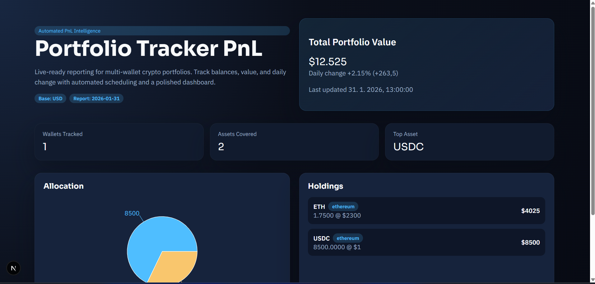

# Portfolio Tracker PnL

Professional-grade crypto portfolio tracking with automated reporting, real-time pricing, and a polished dashboard.

## Highlights

- Automated daily tracking via GitHub Actions
- Multi-wallet support with configurable tokens
- PnL snapshots with change tracking
- Web dashboard with allocation visuals
- Webhook delivery for alerts and integrations
- Production-ready configuration and documentation

## Architecture

```
backend (Node.js)
  src/tracker.js           orchestrates data collection + report generation
  src/services/balances.js chain + token balances
  src/providers/           price providers (CoinGecko)
  reports/                 generated JSON reports

frontend (Next.js)
  web/pages/index.js       dashboard UI
  web/pages/api/report.js  report API for UI
```

## Quick Start

### Prerequisites

- Node.js 24+
- npm

### Install

```bash
npm install
cd web && npm install && cd ..
```

### Configure

1) Copy env file:
```bash
copy .env.example .env
```

2) Edit `config/wallets.json` with your wallets and tokens.

### Run (Live)

```bash
npm run track
```

### Run (Offline / Dry)

```bash
npm run track:dry
```

### Start Dashboard

```bash
cd web
npm run dev
```

## Configuration

`config/wallets.json` supports:

- `baseCurrency` (default: USD)
- `wallets[]` with `address`, `label`, `chain`
- `tokens[]` with `symbol`, `type`, `address`, `decimals`, `coingeckoId`, `mockBalance`, `mockPriceUsd`
- `chains` with RPC env key mapping

Example snippet:

```json
{
  "wallets": [
    { "address": "0x...", "label": "Treasury", "chain": "ethereum" }
  ],
  "tokens": [
    { "symbol": "ETH", "type": "native", "coingeckoId": "ethereum" },
    { "symbol": "USDC", "type": "erc20", "address": "0xA0b8...", "decimals": 6, "coingeckoId": "usd-coin" }
  ]
}
```

## Reporting

Reports are stored in `reports/report-YYYY-MM-DD.json` and include:

- per-asset balances
- USD valuation
- daily change vs previous report
- wallet and chain metadata

## Automation

GitHub Actions:

- `.github/workflows/daily-tracker.yml` runs on a schedule
- `.github/workflows/ci.yml` validates build and offline tracking

### Required Secrets

- `ETH_RPC_URL` or `ALCHEMY_API_KEY` or `INFURA_PROJECT_ID`
- `WEBHOOK_URL` (optional)

## Webhooks

Set `WEBHOOK_URL` to receive the full report JSON after each run.

## Scripts

- `npm run track` live chain + price fetch
- `npm run track:dry` offline, prints report

## Troubleshooting

- Missing RPC: set `ETH_RPC_URL` or `ALCHEMY_API_KEY` or `INFURA_PROJECT_ID`
- Empty reports: ensure wallets are valid and tokens exist on the configured chain

## Security

See `SECURITY.md`.

## Contributing

See `CONTRIBUTING.md`.

## License

MIT
